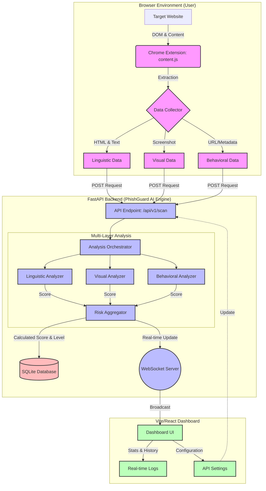

# PhishGuard AI: System Architecture

The following flowchart illustrates the high-level architecture and data flow of the PhishGuard AI detection system, from data collection in the browser to real-time visualization in the dashboard.

## Component Breakdown

### 1. Browser Extension (Data Collector)
- **`content.js`**: Injected into the target website to extract DOM elements, forms, scripts, and full-page content.
- **`background.js`**: Handles cross-origin requests and communicates with the backend API.
- **`popup.js`**: Provides a user interface for manual scans and status updates.

### 2. FastAPI Backend (Analysis Engine)
- **API Endpoints**: Handles data ingestion from the extension and serves stats to the dashboard.
- **Linguistic Analyzer**: Uses NLP to detect phishing triggers, urgency, and AI-generated content patterns.
- **Visual Analyzer**: Employs image hashing and computer vision (OpenCV) to detect brand impersonation.
- **Behavioral Analyzer**: Evaluates URL structure, domain age, and heuristic patterns.
- **WebSocket Server**: Provides instant updates to the dashboard for every new scan performed.

### 3. Monitoring Dashboard (Visualization)
- **Real-time Feed**: Displays incoming scans instantly via WebSocket connections.
- **Analytics**: Shows global statistics on detected threats vs. safe sites.
- **Detailed Logs**: Allows for deep-diving into the individual layer scores (Linguistic, Visual, Behavioral) for any scan.

### 4. Persistence Layer
- **SQLite Database**: Stores a permanent log of all scans, scores, and detailed analysis results for historical review.
